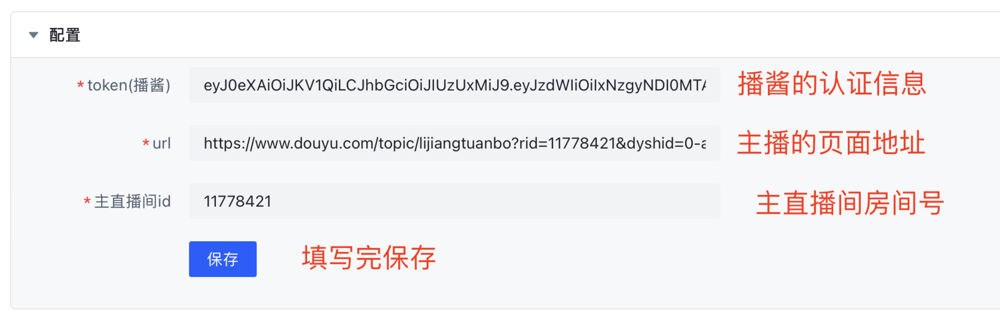
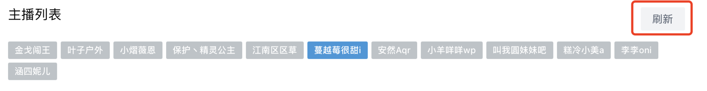
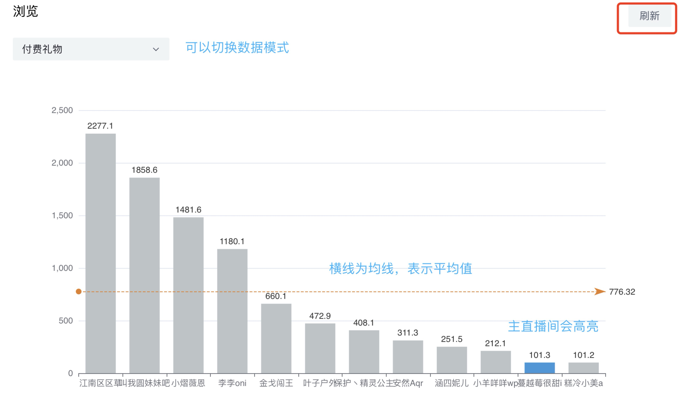

# 斗鱼团播数据分析工具

斗鱼团播分析工具，旨在帮助团播主播能够更清晰的分析数据。数据来源于播酱

## 使用
1. 填写配置

token获取方式：

- 登录[播酱](https://www.bojianger.com/user-login.html?redirect=https%3A%2F%2Fwww.bojianger.com%2F)
- 打开控制台（在播酱的页面右键点击选择**检查**）
- 1. 选择 Application 2. 找到 Local Storage 选择网址 3. 找到token，复制对应的值

2. 点击主播列表右侧的刷新按钮以获得主播列表

3. 点击浏览右侧的刷新按钮以获得所有主播数据（需要多等几秒）

## 注意事项
1. 不要**频繁**的点击浏览右侧的**刷新按钮**。（因为数据来源是播酱，获取主播数据的时候需要调用多次接口（10个主播就是10个接口），多次频繁调用可能会导致你的ip或者播酱账号被封）